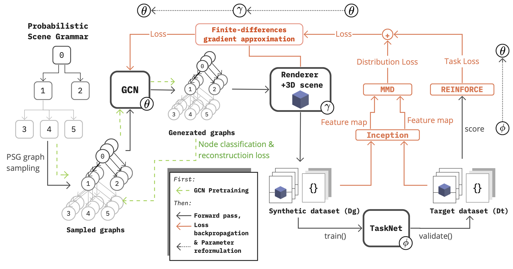
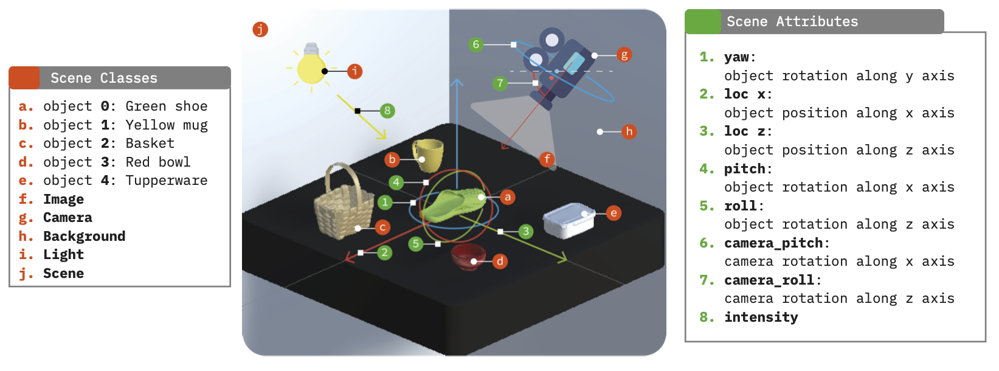
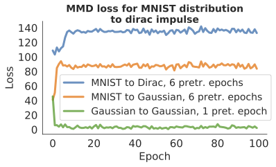
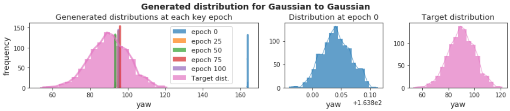
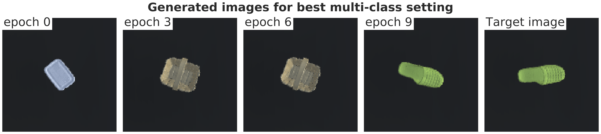
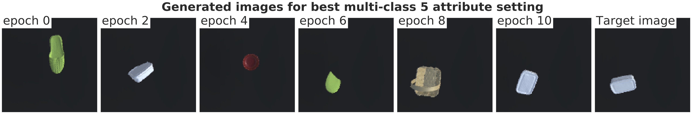

## **Meta-Sim exploration**
The proposed project systematically investigates the scalability, modularity and applicability of the meta-sim model to increasingly complex applications. In this case, we use the 3D-TYOL testing environment inspired from the TYO-L [1] dataset found [here](https://bop.felk.cvut.cz/datasets/), fully explained in the dissertation, which can also be found in `custom-exp/dissertation` folder. We use an adapted version of Kar et al. [2] code found [here](https://github.com/nv-tlabs/meta-sim).

>**Note:** For a recording `custom-sim-walkthrough.mp4` that complements this explanation showing how to run the repository click [here](https://drive.google.com/file/d/19NBEAacwmvv5A7QnRuDonOUn3qGJ2GXa/view?usp=sharing).

The meta-sim architecture represents a 3D environment in a rendering engine as a graph. It uses a Graph Convolutional Network (GCN) to learn the graph structure, and then uses a 3D rendering engine to generate images from the graph. The architecture is trained using a Maximum Mean Discrepancy (MMD) loss, which is a measure of distance between two distributions. The architecture is trained to generate images from a source distribution that are as close as possible to a target distribution.

A quick snapshot of the architecture can be seen below:

The scene we will use is built in Unity. We defne multiple scene attributes that can be used to modifythe scene. We also define a set of classes,the available objects in the scenem, and the Camera, Light, Background, Scene and Image. The latter are nodes in the scene, while the former are node poperties for the available objects.

### **Sample results learning to rotate a single asset**
During training, the architecture is learning to rotate a single object 90 degrees based on a target dataset whose distribution is centered around 90 degrees. 
We can see this in the following animations:

We can see the generated images:

We can see that the architecture's MMD loss experiences convergence:

And the generated mean convergence towards the mean of the target distribution:

### **Sample results learning to rotate a single asset**
During training, the architecture is learning to rotate a single object 90 degrees based on a target dataset whose distribution is centered around 90 degrees. 

We can see the generated images:

We can see that the architecture's MMD loss experiences convergence:

And the generated mean convergence towards the mean of the target distribution:

### Sample results learning to rotate a single asset from a pool of multiple ones
We extended the learning task to for the network to learn more degrees of freedom to match the target image. In this case, the network is learning to rotate and choose a single object from a pool of multiple ones to match the target

In the example below the network learns to select the right asset and rotate it to a 90 degree angle:

### **Sample results learning to rotate and move a single asset from a pool of multiple ones**
We extended the learning task to for the network to learn more degrees of freedom to match the target image. In this case, the network is learning to rotate and move a single object from a pool of multiple ones.

In the example below, the network learns to select the right asset, and move it to the right position.

### **Bibliography**
[1] Hodaň, T., Michel, F., Brachmann, E., Kehl, W., Buch, A. G., Kraft, D., Drost, B., Vidal, J., Ihrke, S., Zabulis, X., Sahin, C., Manhardt, F., Tombari, F., Kim, T. K., Matas, J., & Rother, C. (2018). BOP: Benchmark for 6D object pose estimation. Lecture Notes in Computer Science (Including Subseries Lecture Notes in Artificial Intelligence and Lecture Notes in Bioinformatics), 11214 LNCS, 19–35. https://doi.org/10.1007/978-3-030-01249-6_2

[2] Kar, A., Prakash, A., Liu, M. Y., Cameracci, E., Yuan, J., Rusiniak, M., Acuna, D., Torralba, A., & Fidler, S. (2019). Meta-sim: Learning to generate synthetic datasets. Proceedings of the IEEE International Conference on Computer Vision, 2019-Octob, 4550–4559. https://doi.org/10.1109/ICCV.2019.00465