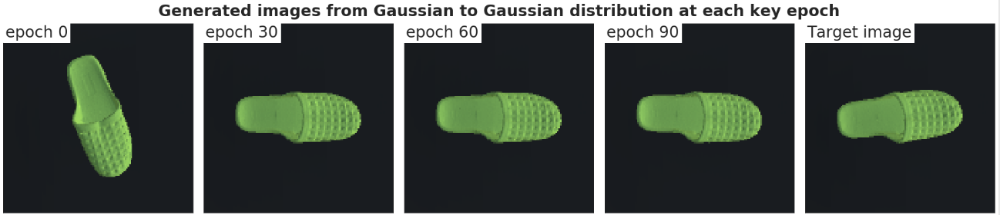

## **Meta-Sim exploration**
The proposed project systematically investigates the scalability, modularity and applicability of the meta-sim model to increasingly complex applications. In this case, we use the 3D-TYOL testing environment inspired from the TYO-L [1] dataset found [here](https://bop.felk.cvut.cz/datasets/), fully explained in the dissertation, which can also be found in `custom-exp/dissertation` folder. We use an adapted version of Kar et al. [2] code found [here](https://github.com/nv-tlabs/meta-sim).

>**Note:** For a recording `custom-sim-walkthrough.mp4` that complements this explanation showing how to run the repository click [here](https://drive.google.com/file/d/19NBEAacwmvv5A7QnRuDonOUn3qGJ2GXa/view?usp=sharing).

### **Directory tree explanation**
Below we find the full directory of the currrent folder. ``custom-sim`` contains the full information to run a sample model.

```py
.
└── custom-sim
    ├── analysis_notebooks
    │   └── figures
    ├── data
    │   ├── datagen
    │   ├── features
    │   ├── generator
    │   ├── loaders
    │   └── renderer
    ├── dissertation
    ├── environment
    ├── experiments
    │   └── bash_experiments
    ├── models
    │   ├── layers
    │   └── tasknet
    ├── results
    │   ├── mnist
    │   ├── single
    │   └── multi
    ├── scripts
    │   ├── data
    │   └── train
    └── utils
```
- ``custom-sim/analysis_notebooks`` contains the ``.ipynb`` files corresponding to each experimenting section from the dissertation (4.1, and 4.2 for the single-class, and multi-class setting experiments, and Appendix E for the MNIST experiments). All relevant results are loaded there, with their respective descriptions and interpretations.
-  The file ``custom-sim/data/renderer/tyolUnity_v2.py`` contains the script that attaches the Unity process to the Python process.
- ``custom-sim/dissertation`` contains the ``.pdf`` file with the full dissertation.
- ``custom-sim/environments`` contains all dependencies necessary to create a new python environment that can run Meta-Sim.
- ``custom-sim/experiemnts`` contains the ``.yml`` configuration files to run experiments with multiple hyperparameter variations.
- ``custom-sim/models``, ``./scripts``, and ``./utils`` contains necessary scripts to run Meta-Sim.
    - Inside the ``./scripts/train/train_tyol.py`` you can find the full code used to train Meta-Sim for own experiments.
- Finally, ``custom-sim/results`` contains a sample of what the results from a given experiment from the MNIST (``custom-sim/results/mnist``), single-class (``custom-sim/results/single``), or multi-class (``custom-sim/results/multi``) look like. Normally, our program generates a dataset every 2 epochs of training, so we can visualize the generated distributions. This amount of images for each experiment cannot be included here due to space limitations. We therefore only include the generated images at the first and final epoch of training, and the target dataset used during the experiment, which is also generated.

### **Installing the dependencies**

To use the current `custom-exp` director to run a single-class 1-attribute sample experiment, follow these steps. 

1. Run `git clone --branch custom-exp https://github.com/neurolaboratories/meta-sim.git`.
2. Then `cd meta-sim` and `cd custom-sim` , we will run all code from the `custom-sim` location.
3. Now we will use the `environment/metasim_environment.yml` environment to create the environment with all the necessary packages. Run `conda env create --file environment/metasim.yml` from the `custom-sim` directory. 
    - Alternatively, create a conda environment and run `pip install -r environment/metasim_requirements.txt`.
4. Now activate the environment by running `conda activate metasim` or the name you gave it.
5. Now lets define the python path that our script will be using, run `export PYTHONPATH=$PWD:$PYTHONPATH`. This is important, everytime something doesn't seem to be downloading, or running, you might have to rerun this. You can add this to your `~./bashrc` for future use using ``echo 'export PYTHONPATH=$PWD:$PYTHONPATH' >> ~/.bashrc``.

>**Note:** if steps 3 and 4 don't work, open the `metasim_requirements.txt` file and manually install all libraries using `conda install`, since we are using a conda environment. Make sure to install the correct package versions. If `conda install` does not have the package available, use `pip install`.

### **Downloading data and data generators**
#### _MNIST generators_
1. Now let's download all baseline assets for MNIST experimentation. Run `bash ./scripts/data/download_assets.sh`.
2. Now let's generate the target MNIST data, run `python scripts/data/generate_dataset.py --config data/generator/config/mnist_val.json`. And then, run `python scripts/data/generate_dataset.py --config data/generator/config/bigmnist_val.json`.

#### _3D TYO-L generators_
1. Let us download all relevant scenes from a gcloud storage bucket so we can generate data from there. Let us do this from the `custom-sim/data` folder by running `gsutil -m cp -r gs://meta-sim-bucket/datagen .` (mind the final dot). 

>**Note:** Beware that this step will download around 10Gb worth of scenes. Alternatively, you can go [here](https://console.cloud.google.com/storage/browser/meta-sim-bucket) and download the specific files according to the explanation in the following section.


### **The data directory**
- ``custom-sim/data`` contains all relevant folders for the data loading, PSG sampling, and rendering. Specially, ``custom-sim/data/datagen/scenes`` contains:
```
└── scenes
    ├── blender
    │   ├── target
    │   └── textures
    ├── real
    └── unity
        ├── 3d_scene
        ├── 3d_scene_multi
        ├── 3d_scene_multi_v4
        ├── 3d_scene_tgt
        ├── 3d_scene_tgt_multi
        ├── 3d_scene_tgt_multi_v4
        ├── 3d_scene_tgt_v3
        ├── 3d_scene_tgt_v4
        ├── 3d_scene_v3
        └── 3d_scene_v4

```
- `blender` contains some sample scenes from Blender, but that are unused, and `real` contains real images inspired from the TYO-L dataset.
- And `unity` contains all scenes built in Unity. The format of the naming is as follows:
    - `3d_scene_<version>` is the single-class setting, where:
        - `<version>=None` is the single attribute scene,
        - `<version>=v3` is the 2 or 3 attribute scene, where the Builds v2 corresponds to the 2 attribute scene, and v3 to the 3 attribute scene,
        - `<version>=v4` is the 5 attribute scene,
        - And `tgt_<version>` corresponds to the scene from which we generate the target data,
    - `3d_scene_multi` is the multi-class setting following the same conventions as above.

### **Running the baseline**
To run the baseline, which is basically generating rotated digits, or rotated and translated digits, simply run the following commands. **Note:** the following experiments are running on cpu. To change it to gpu, go to the `./meta-sim/custom-sim/experiments/mnist_rot.yaml` file, and change the `device: 'cpu'` , to `device: 'cuda'` .

- For training on generating *rotated* digits, from the terminal, and from the `custom-sim` folder, run `python scripts/train/train.py --exp experiments/mnist_rot.yaml` .
- For training on generating *rotated and translated* digits, from the terminal, and from the `custom-sim` folder, run `python scripts/train/train.py --exp experiments/mnist_rot_trans.yaml` .

>**Note:** Running the baseline is very important to familiarize oneself with the inner workings of the architecture. Feel free to run it on debugger mode on your prefered IDE. 


### **Running our own implementation on the 3D-TYOL Unity scene**

#### _Generating the target data using Unity_

-  Let's generate the target 3D-TYOL data, from the `custom-sim` folder, run `data/datagen/scenes/unity/3d_scene_tgt/Builds/3dv1.x86_64 --batchmode`. This builds the Unity 3D scene and generates our desired target dataset.

#### _Running Meta-Sim on the single-class setting_
Please note that we will only run the single-class 1 attribute experiment. The other scenes are not available for public use. However, this should be enough to get a hands on taste of one of the cases that experienced convergence towards the target mean. Let's follow the steps:
1. As per the implementation section in the dissertation, let's start the Unity rendering process first, before starting the Meta-Sim process. From `custom-sim` in a separate run `data/datagen/scenes/unity/3d_scene/Builds/3dv1.x86_64 --batchmode`, this might create a black screen, or a screen showing our 3D scene, just Alt+tab out of it, since it's not minimizeable. This screen can be shut down using Ctrl+C once Meta-Sim is done training.
2. Run the Meta-Sim experiment by opening a separate terminal:
    - On CPU: `python scripts/train/train_tyol.py --exp experiments/tyol_multi_unity_1_attr_cpu.yaml`
    - On GPU: `python scripts/train/train_tyol.py --exp experiments/tyol_multi_unity_1_attr.yaml`
3. You should see 1 epoch of GCN pretraining, and then the architecture starting the MMD training for 100 epochs. If you want to tweak the hyperparameters just go into the `.yaml` file in the `custom-sim/experiments` folder and play with them.
4. If setup correctly, you should be able to see images being generated inside the ``custom-sim/results/single/1_attr/experimentX`` folder, where you can see the progress from `./experimentX/progress/mmd.png` and see the target dataset and generated datasets in the folders `./experimentX/images/target` and `./experimentX/images/most_recent`.

### **Sample results from the above experiment**
During training, the architecture is learning to rotate a single object 90 degrees based on a target dataset whose distribution is centered around 90 degrees. We can see this in the following animations:

We can see the generated images:
<p align="center">

</p>

We can see that the architecture's MMD loss experiences convergence:

<p align="center">

</p>

And the generated mean convergence towards the mean of the target distribution:
<p align="center">

</p>

>**Note:** If you'd like to download results from different experiments shown in the dissertation, please contact Patric Fulop for more.

### **Bibliography**
[1] Hodaň, T., Michel, F., Brachmann, E., Kehl, W., Buch, A. G., Kraft, D., Drost, B., Vidal, J., Ihrke, S., Zabulis, X., Sahin, C., Manhardt, F., Tombari, F., Kim, T. K., Matas, J., & Rother, C. (2018). BOP: Benchmark for 6D object pose estimation. Lecture Notes in Computer Science (Including Subseries Lecture Notes in Artificial Intelligence and Lecture Notes in Bioinformatics), 11214 LNCS, 19–35. https://doi.org/10.1007/978-3-030-01249-6_2

[2] Kar, A., Prakash, A., Liu, M. Y., Cameracci, E., Yuan, J., Rusiniak, M., Acuna, D., Torralba, A., & Fidler, S. (2019). Meta-sim: Learning to generate synthetic datasets. Proceedings of the IEEE International Conference on Computer Vision, 2019-Octob, 4550–4559. https://doi.org/10.1109/ICCV.2019.00465